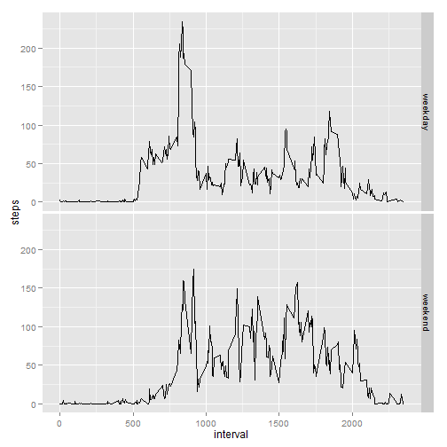

# Reproducible Research: Peer Assessment 1
first of all, set locale to english, and require packages, and other settings

```r
ret<-Sys.setlocale(locale ="English")
require(ggplot2,quietly=TRUE)
options(scipen = 1)
```

## Loading and preprocessing the data
read data from the `activity.csv` inside `activity.zip`

```r
data <- read.csv(
  unz("activity.zip", "activity.csv"),
  colClasses = c("numeric", "Date", "numeric"), 
  header = TRUE, sep = ",", na.strings = "NA"
)
```

all transformations are processed during read, so no more step here.

## What is mean total number of steps taken per day?
sum the steps by date, Calculate mean and median ,then plot a histgram

```r
dailystep<-aggregate(steps ~ date, data=data, FUN=sum)
meandailystep <- mean(dailystep$steps)
mediandailystep <- median(dailystep$steps)
ggplot(dailystep,aes(x=steps))+geom_histogram(binwidth=500)
```

 

so the mean is 10766.1887 and median is 10765


## What is the average daily activity pattern?
average steps by interval, find the interval which has the max steps ,then plot the average

```r
perdaystep<-aggregate(steps ~ interval, data=data, FUN=mean)
interval_maxstep <- perdaystep[which.max(perdaystep$steps),'interval']
ggplot(perdaystep, aes(x = interval, y = steps)) + geom_line()
```

 

so the 835th interval has the max steps


## Imputing missing values


```r
numofna <- sum(is.na(data$steps))
```
so, there are 2304 NA values in raw dataset.

now fill it by use mean for that 5-minute interval

```r
nafilled<-data.frame(data);
nafilled$steps<-apply(data,1,function(x){as.integer(
  ifelse(is.na(x['steps']),
         perdaystep[perdaystep$interval==as.integer(x['interval']), 'steps'],
         x['steps']
  )
)})
```

for the new dataset, sum the steps by date, Calculate mean and median ,then plot a histgram 

```r
nafilleddailystep<-aggregate(steps ~ date, data=nafilled, FUN=sum)
nafilledmeandailystep <- mean(nafilleddailystep$steps)
nafilledmediandailystep <- median(nafilleddailystep$steps)
ggplot(nafilleddailystep,aes(x=steps))+geom_histogram(binwidth=500)
```

 
 
mean is 10766.1887 and median is 10765, there is no major impact on mean and median, they are increasing very slightly 

## Are there differences in activity patterns between weekdays and weekends?

add factor daytype, average steps by interval, then plot the average for each daytype


```r
data$daytype<-apply(data,1,function(x){
  wd<-weekdays(as.Date(x['date']))
  as.factor(ifelse(wd=="Saturday"||wd=="Sunday","weekend","weekday"))
})
perdaystep2 <-aggregate(steps ~ interval + daytype, data=data, FUN=mean)
ggplot(perdaystep2, aes(x = interval, y = steps)) + geom_line() + facet_grid(daytype ~ .)
```

 
